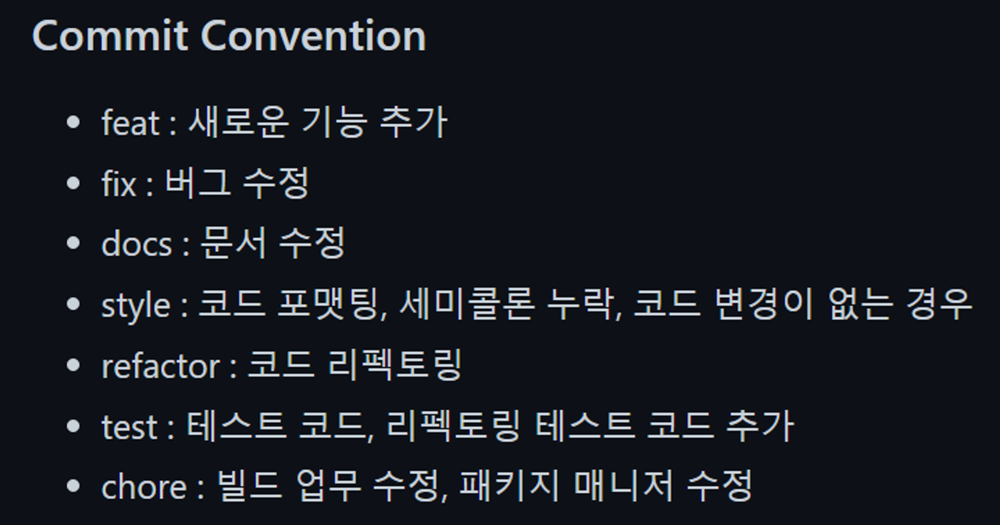
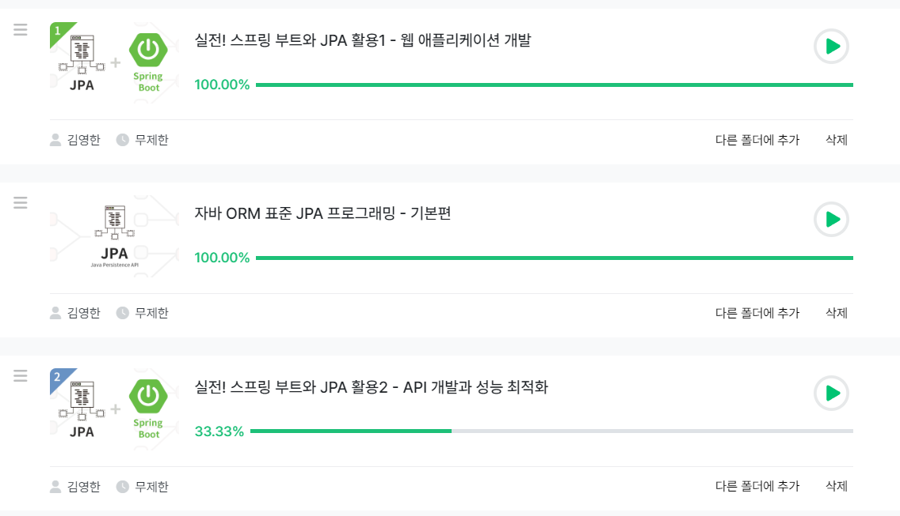

## 2023-01-08

아이디어 회의

## 2023-01-09

Commit Convention
Git Commit Convention : https://gist.github.com/stephenparish/9941e89d80e2bc58a153
<br>


<br>
https://kdjun97.github.io/git-github/commit-convention/

```
# 제목은 최대 50글자까지 아래에 작성: ex) Feat: Add Key mapping

# 제목은 한글로 작성 가능

# 본문은 아래에 작성

# 꼬릿말은 아래에 작성: ex) Github issue #23

# --- COMMIT END ---

# <타입> 리스트

# feat : 기능 (새로운 기능)

# fix : 버그 (버그 수정)

# refactor : 리팩토링

# style : 스타일 (코드 형식, 세미콜론 추가: 비즈니스 로직에 변경 없음)

# docs : 문서 수정 (문서 추가, 수정, 삭제, README)

# test : 테스트 (테스트 코드 추가, 수정, 삭제: 비즈니스 로직에 변경 없음)

# chore : 기타 변경사항 (빌드 스크립트 수정, assets, 패키지 매니저 등)

# ------------------

# 제목 첫 글자를 대문자로

# 제목은 명령문으로

# 제목 끝에 마침표(.) 금지

# 제목과 본문을 한 줄 띄워 분리하기

# 본문은 "어떻게" 보다 "무엇을", "왜"를 설명한다.

# 본문에 여러줄의 메시지를 작성할 땐 "-"로 구분

# ------------------

# <꼬리말>

# 필수가 아닌 optional

# Fixes :이슈 수정중 (아직 해결되지 않은 경우)

# Resolves : 이슈 해결했을 때 사용

# Ref : 참고할 이슈가 있을 때 사용

# Related to : 해당 커밋에 관련된 이슈번호 (아직 해결되지 않은 경우)

# ex) Fixes: #47 Related to: #32, #21

```

<br>
Git Branch Convention
main : 찐 서비스가 배포 → 함부로 merge하면 젠킨스 할아버지가 화내요

develop : 개발중인 서비스 배포

feat : 기능 개발 중

## 2023-01-10

ERD 설계
<br>


## 2023-01-11

JPA 강의 구매 및 수강 중
<br>


Kafka 강의 구매 및 수강 중
<br>
