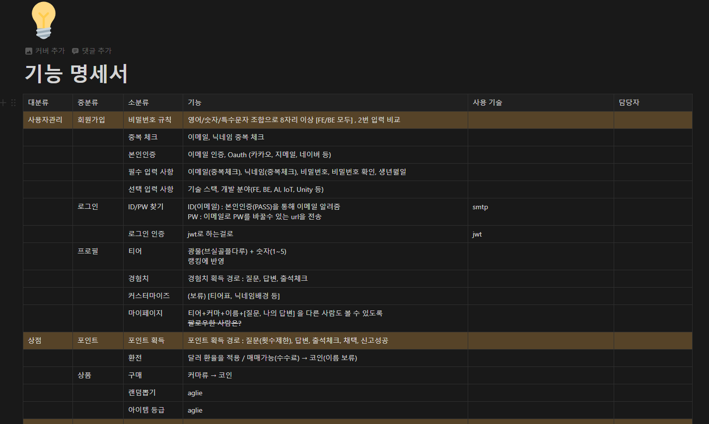
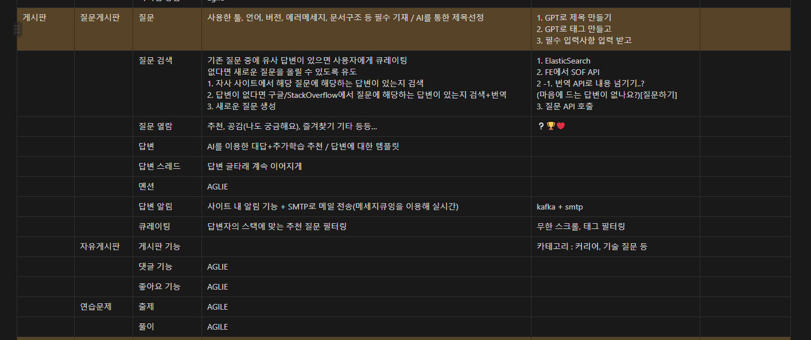
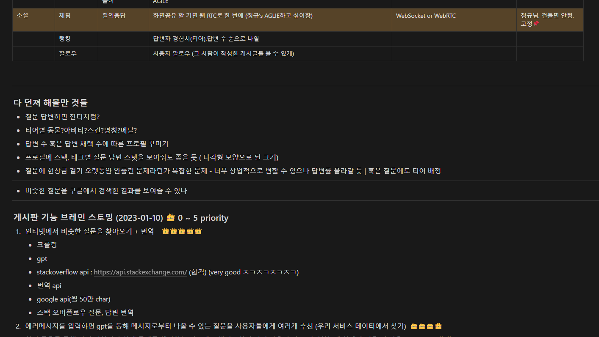
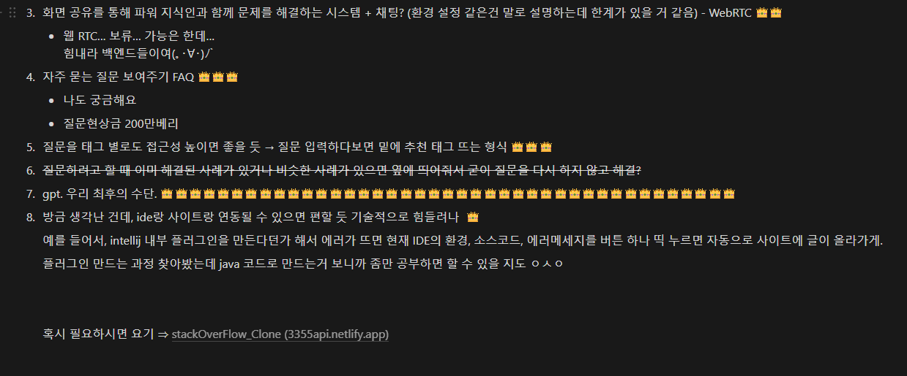
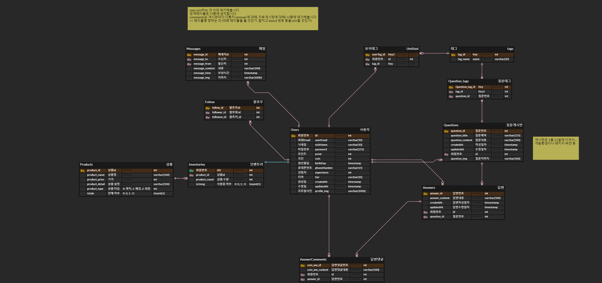
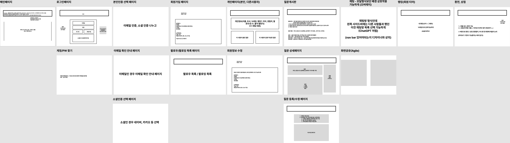

# 공통 PJT 정진영 README

## 1. Vuetify를 사용하는 pjt 시작하기(24.01.09)
- 1학기 수업 때는 node.js의 npm을 이용하여 `npm create vue@latest`를 이용하여 프로젝트를 시작했지만, vuetify를 사용하기 위한 방법 중 하나로 이제 vue-cli를 이용하여 vuetify를 쓰는 프로젝트를 생성할 것이다.

### 1) vue-cli 설치
```bash
npm i -g @vue/cli
# 한 번만 하면 됨
```

### 2) pjt 생성
```bash
vue create 프로젝트명
# 프로젝트명은 케밥 케이스로!
```

### 3) vuetify 추가
```bash
cd 프로젝트명
npm i vuetify  # 한 번만 하면 됨
vue add vuetify  # 버전 선택은 Vuetify 3 - Vue CLI

npm run serve  # 로컬 서버 실행
```

### 4) prettier 설정

1. extensions에서 `prettier` 설치
2. settings에서 `Editor: Default Formatter`에서 `Prettier - Code formatter` 선택
3. `editor format on save` 검색, 체크
4. `Prettier` 검색, `Prettier: Print Width` → 120
5. `Prettier: Semi` 체크
6. `Prettier: Single Quote` 체크
7. `Prettier: Tab Width` → 4
8. `Prettier: Trailing Comma` → es5
9. 루트 dir 안에 `.prettierrc` 파일 생성 후 아래 코드 추가

```
{
  "printWidth": 120,
  "tabWidth": 4,
  "singleQuote": true,
  "trailingComma": "all",
  "semi": false
}
```

### TIL 후기
- 기존의 npm을 사용하여 프로젝트를 생성하는 방식이 아닌, vue-cli를 사용하여 프로젝트를 생성하고, vue-cli의 존재에 대해 처음 알게 되었다. 또한 vuetify를 사용하기 위해 이것저것 찾아봤었다. vuetify를 설치하여 프로젝트를 처음 시작하는 방법을 익혔다. 이전 1학기 최종 프로젝트 때 bootstrap을 이용하긴 했지만 단순히 색을 칠하고 정렬하는 데에 그친 것 같았고, 다른 교육생들의 페이지를 보며 좀 더 예쁘게 꾸며보고 싶다는 생각을 했었는데, 이제 그 시작을 열었다는 마음에 기대가 된다. 비록 멋들어지게 꾸미는 것이 쉽지는 않겠지만, 오히려 도전정신을 불러일으키고 설레는 마음을 가지게 되었다.
---
<br>

## 2. 기능 명세서 구체화 및 ERD 작성(24.01.10)

### 1) 기능 명세서
- 사진 1<br>
<br>
- 사진 2<br>
<br>
- 사진 3<br>
<br>
- 사진 4<br>



### 2) ERD


### TIL 후기
- 기능명세서를 구체화하고, ERD를 함께 논의하여 작성해보았다. 우리가 구현할 기능을 생각하며 ERD를 만들어보니 머리 속에 우리가 만들 서비스가 조금은 더 구체화되지 않았나 하는 생각을 했다. 또한 이후 개발 단계에서 변경 사항을 줄이기 위해 가능한 상세하게 작성하는 것이 중요하겠다는 생각을 했다.
---
<br>

## 3. ERD 구체화 및 화면 정의서 작성(24.01.11)

### 1) ERD 구체화


### 2) 화면 정의서


### TIL 후기
어제 만들던 ERD에 필요한 엔터티를 추가하고, 속성들을 변경하였다. 또한 어떤 페이지에 어떤 기능들이 들어가야 하는지 틀을 잡기 위해 화면 정의서를 작성해보았다. 와이어프레임이라고 불리는 만큼, UI적인 측면보다는 UX적인 측면에 대해 더 생각해본 것 같다. 이후 디자인을 적용할 때에는 UI와 UX적인 측면을 모두 고려해야 할 것이 예상된다. 오늘도 마찬가지로 개발의 용이함을 위해 구체적인 설계를 하며 이후 개발 단계와 전체 프로젝트의 청사진을 그릴 수 있었다.